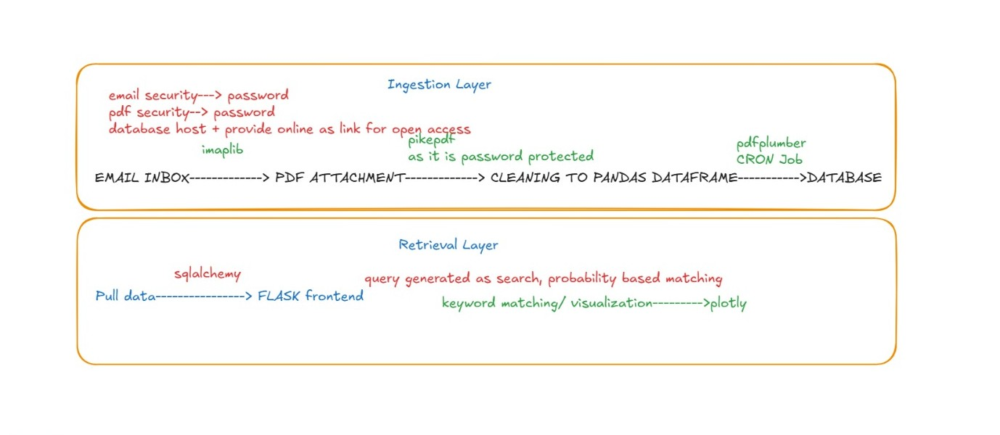

# Pennylook: Automated Financial Statement Analysis

Pennylook is a web-based financial management application designed to automate the aggregation and visualization of bank transaction data. The system specifically targets the extraction of data from Axis Bank e-statements delivered via Gmail, transforming encrypted PDF documents into structured insights.

---

## 🛠 Project Architecture

The application is built on a modular pipeline that handles data ingestion, security decryption, and interactive visualization.

### Core Components:
* **Data Ingestion**: Utilizes the IMAP protocol to securely access Gmail.
* **Cryptographic Handling**: Employs `pikepdf` to decrypt password-protected attachments.
* **Data Extraction**: Uses `pdfplumber` to parse complex tabular data.
* **Data Persistence**: Stores records in a SQLite database with MD5 deduplication.

---

## 🔄 System Workflow

Below is the visual representation of the data pipeline:

---

## 🎥 Functional Demonstration

This video demonstrates the synchronization process and the interactive dashboard:

---

## 🚀 Quick Start

1. **Install Dependencies**: `pip install flask pandas plotly pdfplumber pikepdf python-dotenv`
2. **Configure Credentials**: Add your details to a `.env` file.
3. **Run**: `python app.py`

---

## 🔒 Security
Pennylook isolates credentials using environment variables and utilizes Google's App Password system to ensure primary account security.